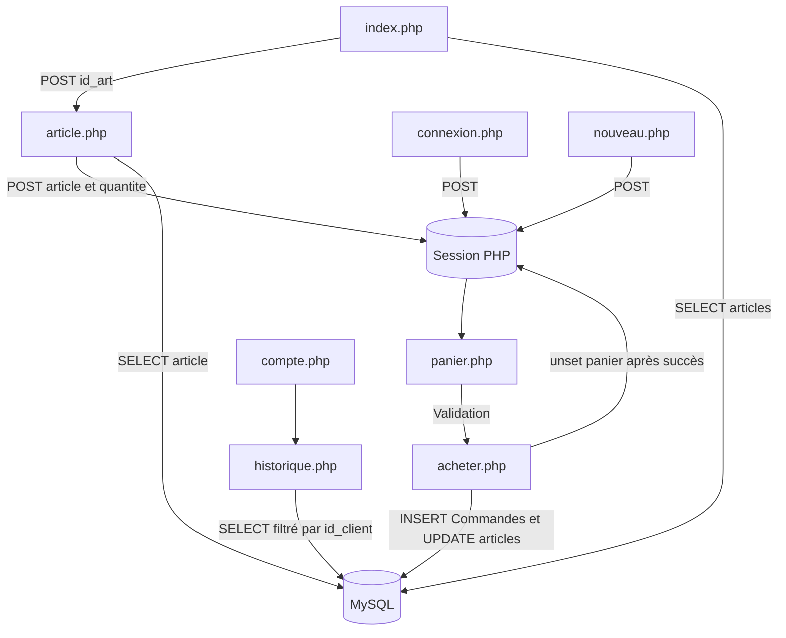

# Architecture de Frames & cores

## 1. Vue d'ensemble

Frames & cores est un site de vente de matériel informatique développé sans framework.
Les pages PHP rendent les vues et traitent directement les formulaires. PDO centralise
les échanges avec MySQL, tandis que les sessions PHP conservent l'identité du client et
son panier entre deux requêtes.

Technologies utilisées :

- **PHP** pour le rendu serveur et la logique métier ;
- **MySQL** pour les articles, les utilisateurs et les commandes ;
- **PDO** pour les requêtes préparées et les transactions ;
- **HTML/CSS** pour la structure et l'interface ;
- **Sessions PHP** pour l'authentification et le panier.

Les commentaires placés dans les blocs PHP sont traités côté serveur. Ils documentent
le code source et ne sont donc pas envoyés dans le HTML généré.

## 2. Arborescence

```text
TyldenHounsa/
|-- index.php                         Catalogue et accueil
|-- article.php                       Fiche et ajout au panier
|-- panier.php                        Consultation et validation du panier
|-- acheter.php                       Enregistrement d'une commande
|-- historique.php                    Historique du client connecté
|-- compte.php                        Espace du client
|-- connexion.php                     Formulaire de connexion
|-- nouveau.php                       Formulaire de création de compte
|-- contact.html                      Page statique de contact
|-- ARCHITECTURE.md                   Documentation technique
|
|-- assets/
|   |-- css/style.css                 Feuille de style commune
|   |-- js/main.js                    Fichier conservé, sans logique active
|   |-- js/panier.js                  Fichier réservé aux évolutions du panier
|   `-- images/                        Images des produits
|
|-- includes/php/
|   |-- bd.php                        Connexion PDO à MySQL
|   |-- submit_connexion.php          Traitement de la connexion
|   |-- submit_formulaire.php         Traitement de l'inscription
|   `-- disconnect.php                Fermeture de session
|
`-- database/
    `-- computer_database.sql         Schéma et données initiales
```

## 3. Flux applicatif



## 4. Parcours du catalogue et du panier

### Catalogue

`index.php` démarre la session, charge les articles depuis la table `articles` et
échappe les valeurs avant leur insertion dans le HTML. Chaque carte contient un
formulaire `POST` vers `article.php` avec le champ caché `id_art`.

La fiche n'est donc plus ouverte par une redirection JavaScript ou par un identifiant
placé dans l'URL.

### Fiche article

`article.php` récupère `id_art` depuis `$_POST`, puis recherche l'article avec une
requête préparée. Le formulaire d'ajout renvoie l'identifiant, l'action et la quantité.

Avant d'écrire dans la session, le serveur :

1. vérifie que la quantité est un entier positif ;
2. vérifie l'existence de l'article ;
3. limite la quantité au stock courant ;
4. additionne la quantité à celle déjà présente pour l'article.

Le panier utilise la structure suivante :

```php
$_SESSION['panier'][id_art] = quantite;
```

### Panier

`panier.php` relit les informations des articles depuis MySQL. La session ne contient
que les identifiants et les quantités ; elle ne fait pas autorité pour les prix ou le
stock. La page calcule chaque sous-total ainsi que le total général.

Le bouton de suppression est traité par `panier.php` en `POST`. Il utilise
`unset($_SESSION['panier'])`, puis redirige vers la même page.

## 5. Authentification et sessions

`submit_connexion.php` recherche l'utilisateur par e-mail et vérifie le mot de passe
avec `password_verify()`. Après une connexion réussie, l'identifiant est conservé avec
les informations d'affichage :

```php
$_SESSION['id_client'] = $utilisateur['id_user'];
$_SESSION['nom'] = $utilisateur['nom'];
$_SESSION['prenom'] = $utilisateur['prenom'];
```

`submit_formulaire.php` crée le compte avec `password_hash()`, récupère l'identifiant
généré par MySQL et initialise les mêmes valeurs de session.

`compte.php` est accessible uniquement lorsque le nom et le prénom sont présents dans
la session. Le lien vers `historique.php` permet au client de consulter ses commandes.

## 6. Enregistrement d'une commande

`acheter.php` exige un `id_client` valide et un panier non vide. Le traitement utilise
une transaction PDO :

1. les lignes d'articles sont verrouillées avec `SELECT ... FOR UPDATE` ;
2. le stock courant est comparé à la quantité demandée ;
3. chaque article est inséré dans `Commandes` avec `envoi = FALSE` ;
4. le stock est décrémenté dans `articles` ;
5. la transaction est validée avec `commit()` ;
6. le panier est supprimé avec `unset()` uniquement après cette validation.

En cas d'erreur, `rollBack()` annule les écritures réalisées pendant la transaction et
le panier reste disponible pour une nouvelle tentative.

## 7. Historique des commandes

`historique.php` est réservé au client connecté. Sa requête filtre les lignes avec
`c.id_client = :id_client` et joint `articles` pour afficher le nom et le prix du
produit.

Le tableau présente :

- l'identifiant de commande ;
- l'article commandé ;
- la quantité ;
- le total de la ligne ;
- l'état d'envoi.

La colonne `envoi` vaut `FALSE` lors de l'achat et peut être passée manuellement à
`TRUE` par le gestionnaire.

## 8. Base de données

Le script `database/computer_database.sql` crée les tables `articles`, `user` et
`Commandes`. Les tables utilisant des relations sont en `InnoDB`.

Structure de `Commandes` :

| Colonne | Rôle |
|---|---|
| `id_commande` | Identifiant auto-incrémenté de la ligne commandée |
| `id_art` | Article commandé et clé étrangère vers `articles` |
| `id_client` | Client et clé étrangère vers `user` |
| `quantite` | Quantité commandée |
| `envoi` | État d'envoi, `FALSE` par défaut |

Chaque article d'un panier est enregistré sur une ligne distincte. La structure
conserve ainsi tous les champs demandés tout en permettant une commande composée de
plusieurs articles.

## 9. Sécurité et intégrité

- Les requêtes utilisent des paramètres PDO afin d'éviter la concaténation de valeurs
  fournies par l'utilisateur.
- Les valeurs affichées sont échappées avec `htmlspecialchars()`.
- Les mots de passe sont hachés avec `password_hash()` et vérifiés avec
  `password_verify()`.
- L'identifiant de session est régénéré après une connexion réussie.
- Les quantités et les identifiants sont validés côté serveur.
- La transaction de commande protège la cohérence entre `Commandes` et `articles`.
- Les données de la page d'historique sont filtrées par le client connecté.

## 10. Évolutions possibles

- déplacer les identifiants MySQL de `bd.php` vers des variables d'environnement ;
- ajouter une gestion dédiée des lignes d'une même commande si un identifiant de
  commande commun doit être affiché pour plusieurs articles ;
- ajouter des tests automatisés pour le panier, le stock et la transaction ;
- ajouter une interface d'administration pour modifier `envoi`.
