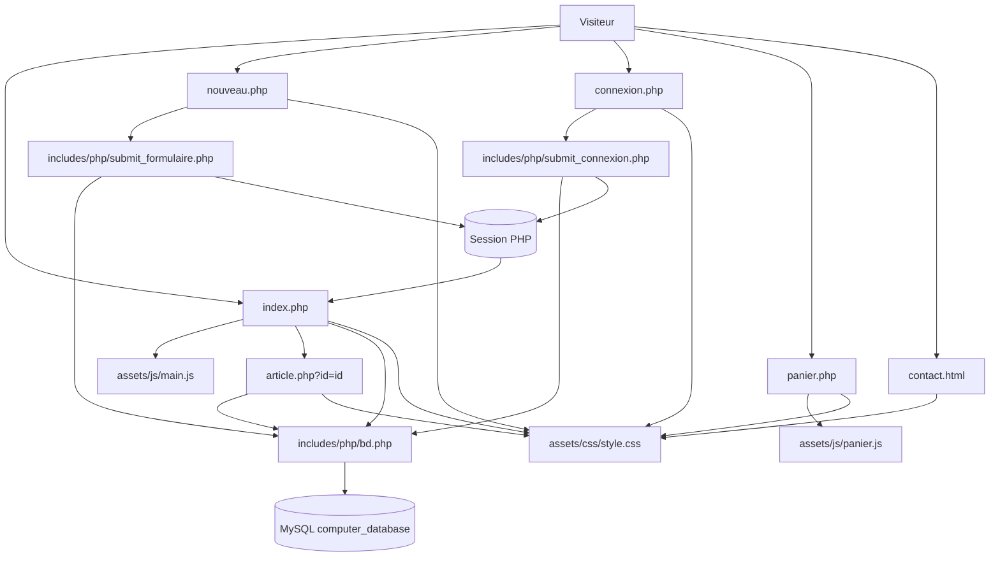
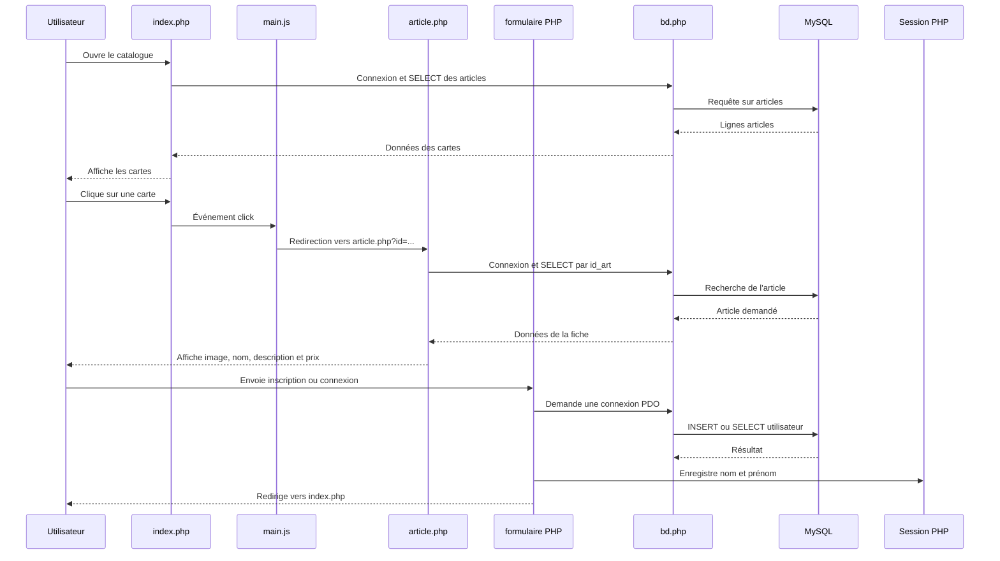

# Architecture de Frames & cores

## 1. Vue d'ensemble

Frames & cores est un site de vente de matériel informatique construit avec :

- **PHP** pour générer les pages et communiquer avec MySQL ;
- **MySQL** pour stocker les articles et les utilisateurs ;
- **HTML** pour structurer les pages ;
- **CSS** pour la présentation et le responsive design ;
- **JavaScript/jQuery** pour certains comportements côté navigateur ;
- **Sessions PHP** pour conserver l'identité de l'utilisateur connecté.

L'application ne repose pas sur un framework. Chaque page PHP joue directement son rôle : afficher une page, traiter un formulaire ou interroger la base de données.

## 2. Arborescence

```text
TyldenHounsa/
|-- index.php                         Accueil et catalogue des articles
|-- article.php                       Fiche détaillée d'un article
|-- connexion.php                     Formulaire de connexion
|-- nouveau.php                       Formulaire de création de compte
|-- panier.php                        Page du panier
|-- contact.html                      Page de présentation et de contact
|-- ARCHITECTURE.md                   Documentation de l'architecture
|
|-- assets/
|   |-- css/
|   |   `-- style.css                 Feuille de style commune
|   |-- js/
|   |   |-- main.js                   Navigation vers une fiche article
|   |   `-- panier.js                  Script prévu pour le panier
|   `-- images/                        Images des produits et du profil
|
|-- includes/
|   |-- php/
|   |   `-- bd.php                     Fonction de connexion à MySQL
|   |-- php/
|   |   |-- submit_formulaire.php      Traitement de l'inscription
|   |   `-- submit_connexion.php       Traitement de la connexion
|
`-- database/
    `-- computer_database.sql          Structure et données initiales
```

## 3. Diagramme général



## 4. Parcours principal de l'utilisateur



## 5. Description détaillée des fichiers

### `index.php`

C'est la page d'accueil et le catalogue.

#### Initialisation de session

```php
session_start();
```

La session permet de récupérer le nom et le prénom d'un utilisateur inscrit ou connecté.

Les valeurs sont ensuite échappées avec `htmlspecialchars()` avant d'être affichées dans le HTML. Le formatage du nom utilise `mb_strtolower()`, `mb_substr()` et `mb_strtoupper()` afin de gérer les caractères accentués.

#### Navigation

Le bloc `.header-nav` contient les liens principaux :

- accueil : `index.php` ;
- présentation : `contact.html` ;
- compte : `connexion.php` ;
- panier : `panier.php`.

Chaque lien contient une icône SVG.

#### Lecture des articles

Le fichier charge la connexion commune :

```php
require_once('./includes/php/bd.php');
```

Puis il exécute une requête SQL :

```sql
SELECT id_art, nom, quantite, prix, url_photo, description
FROM articles
ORDER BY id_art
```

La boucle `foreach` transforme chaque ligne de la base en carte HTML.

Les données textuelles sont protégées avec `htmlspecialchars()`. Le prix est formaté avec `number_format()`.

#### Lien vers une fiche article

Chaque carte possède un attribut `data-url` :

```html
<div class="card" data-url="article.php?id=3">
```

Cet attribut est lu par `main.js` lorsqu'une carte est cliquée.

### `article.php`

Cette page affiche le détail d'un produit sélectionné.

#### Récupération de l'identifiant

```php
$id = filter_input(INPUT_GET, 'id', FILTER_VALIDATE_INT);
```

L'identifiant vient de l'URL :

```text
article.php?id=3
```

`FILTER_VALIDATE_INT` vérifie que l'identifiant est un entier.

#### Recherche SQL

Une requête préparée recherche l'article correspondant :

```sql
SELECT id_art, nom, quantite, prix, url_photo, description
FROM articles
WHERE id_art = :id
```

Le paramètre nommé `:id` évite de concaténer directement une valeur fournie par l'utilisateur dans la requête SQL.

#### Affichage

La fiche affiche :

- l'image ;
- la référence ;
- le nom ;
- la description ;
- la quantité disponible ;
- le prix ;
- un lien de retour vers `index.php`.

La page possède aussi une branche `else` pour afficher « Article introuvable » lorsque l'article n'existe pas.

### `connexion.php`

Cette page contient le formulaire de connexion.

Elle demande :

- l'adresse e-mail ;
- le mot de passe.

Le formulaire envoie ses données vers :

```html
<form action="./includes/php/submit_connexion.php" method="post">
```

Si une erreur est transmise dans l'URL avec le paramètre `error`, elle est affichée dans un bloc `.form-error`.

### `includes/php/submit_connexion.php`

Ce fichier ne produit pas une page complète. C'est un contrôleur de formulaire.

Son fonctionnement est le suivant :

1. démarrage de la session ;
2. chargement de `bd.php` ;
3. vérification que la requête est bien en `POST` ;
4. récupération et nettoyage de l'e-mail et du mot de passe ;
5. validation de l'e-mail ;
6. recherche de l'utilisateur dans la table `user` ;
7. vérification du mot de passe avec `password_verify()` ;
8. régénération de l'identifiant de session ;
9. stockage du nom et du prénom dans `$_SESSION` ;
10. redirection vers `index.php`.

En cas d'erreur, la fonction `redirectToLogin()` renvoie l'utilisateur vers :

```text
connexion.php?error=...
```

### `nouveau.php`

Cette page contient le formulaire de création de compte.

Elle demande :

- le nom ;
- le prénom ;
- l'adresse ;
- le téléphone ;
- l'adresse e-mail ;
- le mot de passe ;
- la confirmation du mot de passe.

Le formulaire utilise les noms attendus par le traitement PHP :

| Champ | Attribut `name` | Utilisation |
|---|---|---|
| Nom | `n` | `$_POST['n']` |
| Prénom | `p` | `$_POST['p']` |
| Adresse | `adr` | `$_POST['adr']` |
| Téléphone | `num` | `$_POST['num']` |
| E-mail | `mail` | `$_POST['mail']` |
| Mot de passe | `mdp1` | `$_POST['mdp1']` |
| Confirmation | `mdp2` | `$_POST['mdp2']` |

### `includes/php/submit_formulaire.php`

Ce fichier traite l'inscription.

Il vérifie :

- que la méthode HTTP est `POST` ;
- que tous les champs sont remplis ;
- que l'e-mail est valide ;
- que le mot de passe contient au moins huit caractères ;
- que les deux mots de passe correspondent.

Le mot de passe n'est jamais enregistré en clair. Il est transformé avec :

```php
password_hash($motDePasse, PASSWORD_DEFAULT)
```

L'insertion est réalisée avec une requête préparée dans la table `user`.

En cas de réussite :

```php
$_SESSION['nom'] = $nom;
$_SESSION['prenom'] = $prenom;
header('Location: ../../index.php');
```

En cas d'erreur, l'utilisateur revient vers `nouveau.php` avec un message dans le paramètre `error`.

### `includes/php/bd.php`

Ce fichier centralise la connexion à MySQL :

```php
function getBD()
{
    $bdd = new PDO(
        'mysql:host=localhost;dbname=computer_database;charset=utf8',
        'root',
        ''
    );

    $bdd->setAttribute(PDO::ATTR_ERRMODE, PDO::ERRMODE_EXCEPTION);
    return $bdd;
}
```

Le mode `PDO::ERRMODE_EXCEPTION` permet de faire remonter les erreurs SQL sous forme d'exceptions, qui peuvent ensuite être traitées dans les blocs `try/catch`.

### `contact.html`

Page statique de présentation du concepteur du site.

Elle utilise :

- `style.css` pour la mise en page ;
- les classes `.contact-page`, `.contact-card`, `.contact-section` et `.back-btn` ;
- un lien e-mail avec `mailto:` ;
- un bouton de retour vers l'accueil.

Elle ne communique pas avec la base de données.

### `panier.php`

Cette page affiche la structure visuelle du panier :

- un message lorsque le panier est vide ;
- une zone `.cart-items` pour les articles ;
- un lien pour continuer les achats ;
- un bouton pour vider le panier.

Elle charge `assets/js/panier.js`, mais ce fichier est actuellement vide dans l'état présent du projet. La page constitue donc principalement la structure HTML et CSS du panier.

### `assets/js/main.js`

Ce script utilise jQuery :

```javascript
$(document).ready(function() {
    $('.card').on('click', function(event) {
        if ($(event.target).closest('.btn-add-cart').length > 0) {
            return;
        }
        window.location.href = $(this).data('url');
    });
});
```

Fonctionnement :

1. attendre que le DOM soit chargé ;
2. sélectionner les éléments `.card` ;
3. écouter leur événement `click` ;
4. ignorer le clic sur le bouton « Ajouter au panier » ;
5. rediriger les autres clics vers l'URL contenue dans `data-url`.

La page `index.php` charge jQuery depuis un CDN avant `main.js`.

### `assets/js/panier.js`

Le fichier est prévu pour gérer le panier côté navigateur, mais il est actuellement vide. Il pourra plus tard :

- lire le panier dans `localStorage` ;
- afficher les articles dans `.cart-items` ;
- modifier les quantités ;
- calculer un total ;
- supprimer un article ;
- vider le panier.

### `assets/css/style.css`

La feuille de style est partagée par les pages du projet.

Elle contient notamment :

- les variables de couleurs dans `:root` ;
- les styles généraux et la remise à zéro CSS ;
- la navigation `.header-nav` et `.nav-btn` ;
- la grille `.products-container` ;
- les cartes `.card` ;
- les formulaires `.formulaire` ;
- les messages `.form-error` ;
- la fiche `.product-detail` ;
- le panier `.cart-container` ;
- la page de contact ;
- les règles responsive avec `@media`.

La grille du catalogue utilise :

```css
grid-template-columns: repeat(auto-fit, minmax(180px, 230px));
```

Cela permet aux cartes de s'adapter à la largeur disponible.

### `database/computer_database.sql`

Ce fichier contient le script d'initialisation de la base `computer_database`.

La table `articles` contient actuellement :

| Colonne | Rôle |
|---|---|
| `id_art` | Identifiant automatique |
| `nom` | Nom du produit |
| `quantite` | Stock disponible |
| `prix` | Prix du produit |
| `url_photo` | Chemin vers l'image |
| `description` | Description détaillée |

Le traitement des inscriptions utilise également une table `user` avec au minimum les colonnes :

- `nom` ;
- `prenom` ;
- `adr` ;
- `num` ;
- `mail` ;
- `mdp`.

## 6. Sécurité utilisée

Le projet utilise plusieurs mécanismes utiles :

- requêtes préparées PDO contre les injections SQL ;
- `htmlspecialchars()` contre l'injection de HTML dans les données affichées ;
- `password_hash()` pour enregistrer les mots de passe ;
- `password_verify()` pour les contrôler lors de la connexion ;
- `session_regenerate_id(true)` après une connexion réussie ;
- validation côté serveur, même si les champs HTML possèdent déjà `required`.

La validation HTML seule ne suffit pas, car elle peut être contournée. Le PHP doit donc toujours vérifier les données reçues.

## 7. Points d'attention actuels

Les éléments suivants méritent une vérification ou une amélioration future :

1. `article.php` doit tester que `$article` existe avant d'accéder à ses champs. Dans sa version actuelle, les lignes qui extraient `id_art`, `nom` et les autres valeurs sont placées avant la branche `if ($article)`. Une URL avec un identifiant invalide peut donc provoquer une erreur avant l'affichage du message « Article introuvable ».
2. `panier.js` est vide : le bouton « Ajouter au panier » et l'affichage du panier doivent être reliés pour obtenir un panier complet.
3. Le fichier SQL fourni décrit principalement `articles`. La table `user` doit également être créée avant de tester l'inscription et la connexion.
4. Le lien du panier doit pointer vers le nom de page réellement utilisé dans le projet (`panier.php`).
5. Les identifiants et mots de passe de base de données sont actuellement écrits dans `bd.php`. En production, ils devraient être placés dans une configuration protégée par des variables d'environnement.

## 8. Résumé du fonctionnement

```text
Accueil
  |
  +--> Liste les articles depuis MySQL
  |
  +--> Clic sur une carte --> article.php?id=...
  |
  +--> Compte --> connexion.php
  |                  |
  |                  +--> submit_connexion.php
  |                         |
  |                         +--> Vérifie user dans MySQL
  |                         +--> Crée la session
  |                         +--> Retourne vers index.php
  |
  +--> Créer un compte --> nouveau.php
                             |
                             +--> submit_formulaire.php
                                    |
                                    +--> Valide les champs
                                    +--> Hash le mot de passe
                                    +--> Insère dans user
                                    +--> Crée la session
                                    +--> Retourne vers index.php
```
